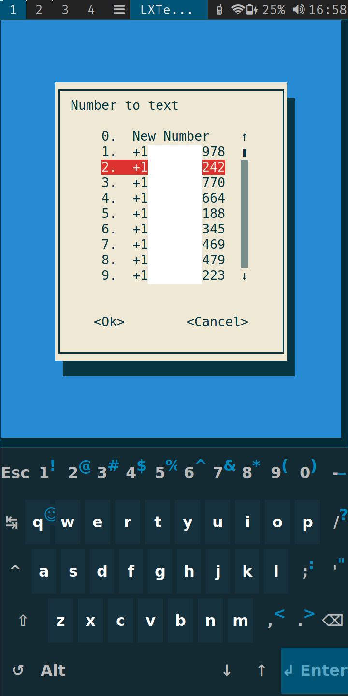
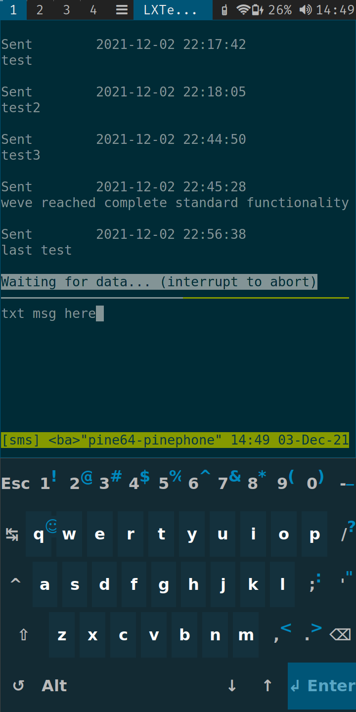
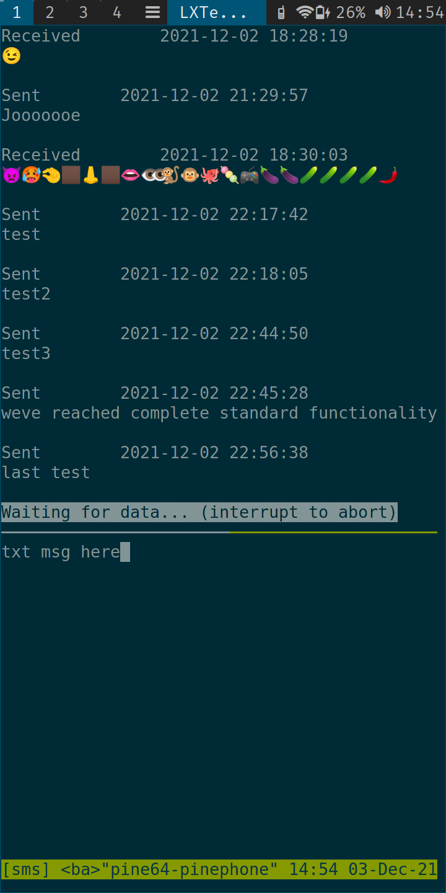

# sxmo-better-sms
Better sms experience on SXMO with standard linux utilities

Currently in development. Will later remake this project in rust or go so its more portable.
Dependencies: tmux, non-busybox less

